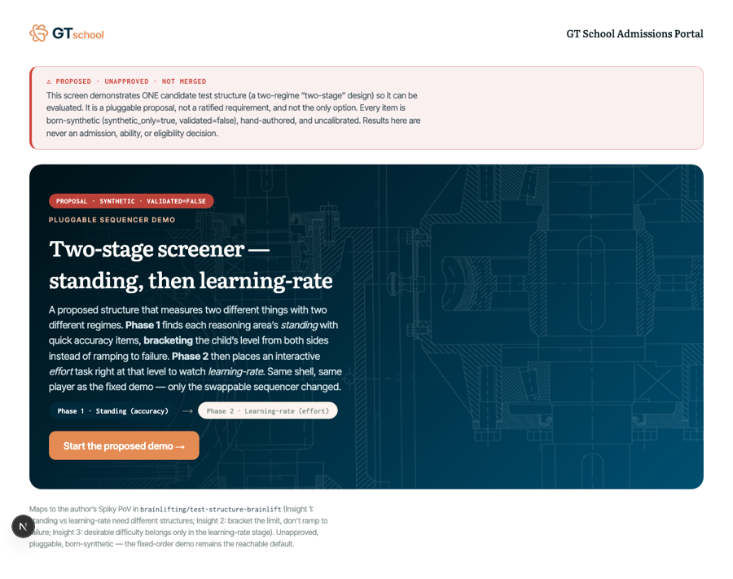
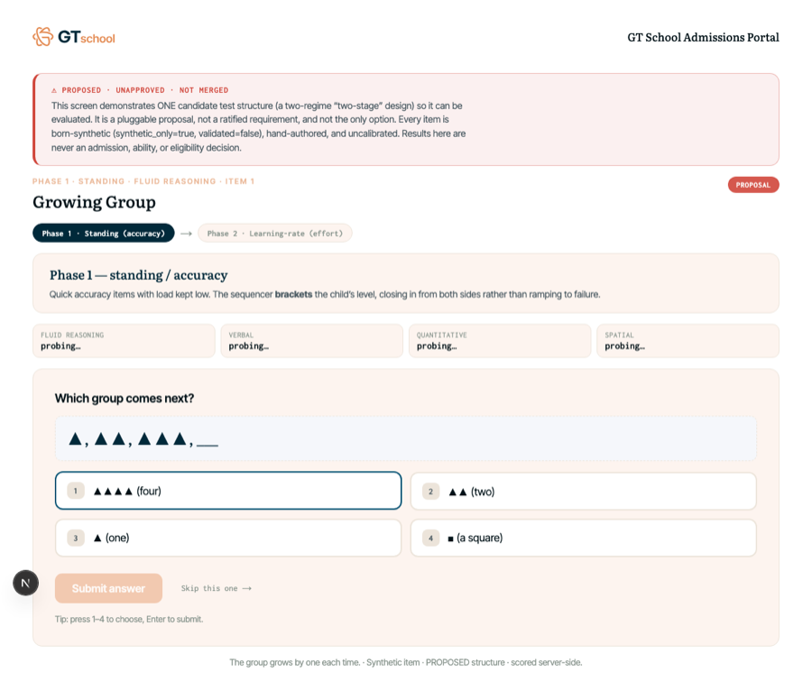
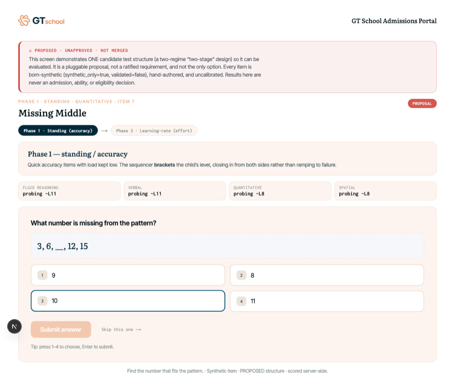
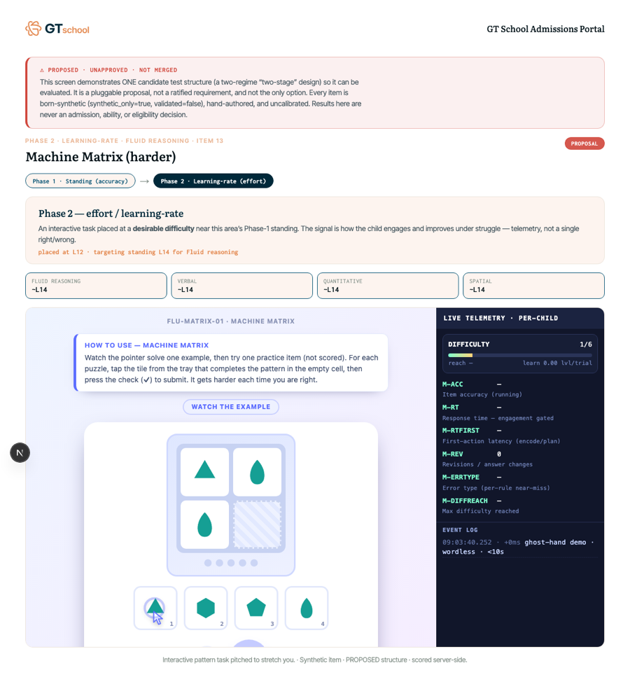
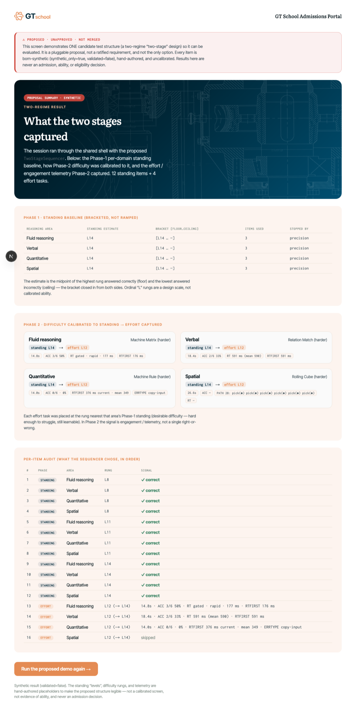
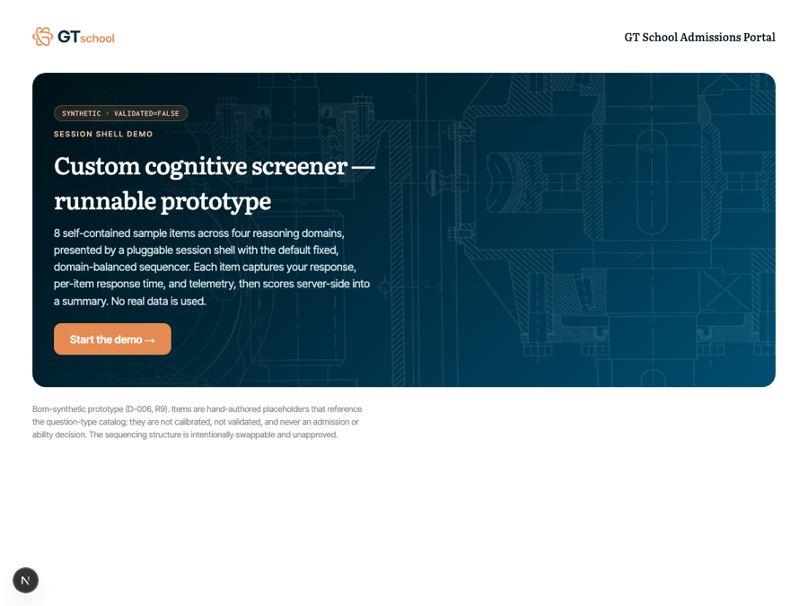
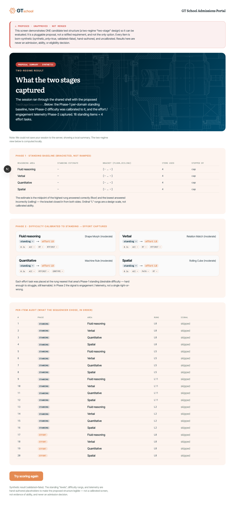

# Two-Stage Screener — Clickable Demo of a PROPOSED Structure

> ## ⚠️ PROPOSAL — unapproved, pluggable structure. NOT merged, NOT ratified.
>
> This document and the code it describes demonstrate **one candidate test
> structure** so it can be evaluated. It is **a proposal, not a requirement**, and
> **one of several possible pluggable structures**. Nothing here is a ratified
> decision, a calibrated instrument, or an admission / ability / eligibility
> decision. Every item is **born-synthetic** (`synthetic_only=true`,
> `validated=false`), hand-authored, and uncalibrated. It lives only on the
> `feat/exam-two-stage-demo` branch and must not be promoted to `dev`/`staging`/
> `main` without an explicit approval + governance decision.

## 1. What this demonstrates

A runnable, born-synthetic demo of the author's **two-regime ("two-stage")** test
structure from the BrainLift
`brainlifting/test-structure-brainlift/brainlift-test-structure.md`. The core
claim is that a screener must measure **two different things** and that they need
**two different structures**:

- **Phase 1 — Standing (accuracy).** *What can the child already do?* Read most
  cleanly **below** the child's limit with cognitive load minimised. To find that
  limit, **bracket** it — close in from both sides — instead of ramping to
  failure.
- **Phase 2 — Learning-rate (effort).** *How well does the child learn under
  difficulty?* Only observable **at/above** the limit, so Phase 2 places an
  interactive task at a **desirable difficulty** near the Phase-1 estimate and
  reads **engagement / telemetry**, not a single right-or-wrong.

Crucially, this is built as **one more pluggable `Sequencer`**, not a rewrite. It
implements the exact same `Sequencer` interface as `FixedSequencer` and runs
through the **unchanged** session shell + item player + server scoring. Swapping
structures is still a one-line change at the call site — the whole point of the
structure-agnostic guardrail in `apps/web/src/lib/exam/sequencer.ts`.

Requirements touched (in prose only — no governance files were edited): the
adaptive-screener line **R11**, born-synthetic posture **R9 / D-006 /
RES-012/013**, auditability/reproducibility **R7 / D-015**, and challenge–skill
engagement **D-016**. The demo asserts **no new validated claim**.

## 2. How to run it (for Crystal / a stakeholder)

From the worktree root
(`gt-worktrees/exam-two-stage-demo`):

```bash
pnpm install
pnpm --filter @gt-selection/web dev
```

Then open **`http://127.0.0.1:3000/dev/exam-two-stage`** (dev-only; the route
returns 404 in production).

Click-through:

1. **Intro** — a loud "PROPOSAL · unapproved · not merged" banner, a plain-English
   description of the two regimes, and a `Phase 1 → Phase 2` chip. Press **Start
   the proposed demo**.
2. **Phase 1 · Standing** — you answer quick accuracy questions. A per-domain strip
   shows the sequencer **bracketing** each reasoning area ("probing ~L8" →
   "~L9.5"). Each domain stops as soon as its level is pinned (usually 2–3 items),
   then rotates to the next domain.
3. **Phase 2 · Learning-rate** — for each area, one **interactive** task appears,
   placed at the difficulty **nearest your Phase-1 standing** ("placed at L8 ·
   targeting standing L9.5"). These are the existing self-adapting `/exam-demos`
   runtimes; the demo harvests their on-screen telemetry.
4. **Summary** — the two-regime story, made legible:
   - **Phase-1 standing baseline** per domain: the estimate, the `[floor … ceiling]`
     bracket, how many items it took, and whether it stopped on *precision* or the
     *cap*.
   - **Phase-2 calibration cards** per domain: `standing Lx → effort Ly`, plus the
     effort/engagement telemetry captured.
   - A **per-item audit** of exactly what the sequencer chose, in order, tagged
     `standing` vs `effort`.

The original fixed-order demo remains reachable and unchanged at
**`/dev/exam-shell`**.

> If the local `/api/exam-results` save is unavailable, the summary still renders
> (computed locally) so the demo never dead-ends.

## 3. How each phase maps to the BrainLift's SPOVs

| BrainLift insight | What the demo does |
| --- | --- |
| **Insight 1** — standing and learning-rate are useful at *different* difficulty levels and need *different* structures (a first standing stage, then a difficulty-scaled second stage). | Two explicit regimes: a single-select **standing** pool (Phase 1) and an embedded-demo **effort** pool (Phase 2). The shell only switches regime when *every* domain's standing is fixed. |
| **Insight 2** — to find a child's limit, **don't ramp to failure; bracket it** and close in from both sides (the SPRT-style behaviour that avoids rapid-guessing, anxiety, and effort loss). | Phase 1 starts at a **moderate** rung, then binary-searches toward the midpoint of the known-correct floor and known-incorrect ceiling. It never marches upward until the child breaks. |
| **Insight 3** — **desirable difficulty** hurts a standing estimate but is exactly what surfaces learning-rate, once the limit is known. | Phase 2 places each effort task at the rung **nearest** the Phase-1 estimate (ties lean *harder*) — hard enough to struggle, still learnable — and treats telemetry/engagement as the signal. |
| **Insight 7** — a retake policy forces the standing stage onto a **large, rotating** bank and forces scoring a retake as a **change in classification** (RCI), not "best of". | Out of scope for this demo, but the design is compatible: the standing pool is a rotatable rung bank, and the classification framing (below) is the natural home for an RCI retake rule. Documented as follow-up. |

On the standing estimator specifically: a production build would drive Phase 1
with an **IRT classification rule** — θ (EAP) from `@gt-selection/cat-engine` plus
an **SPRT/GLR** decision at the cut, which is the same "close in from both sides"
behaviour Insight 2 calls for. Because this synthetic bank carries **ordinal design
rungs and no calibrated IRT parameters**, the demo uses a **transparent running
bracket** over those rungs as the honest, legible stand-in. It is not a calibrated
measure (`validated=false`).

## 4. The routing + stop rules actually implemented

`apps/web/src/lib/exam/two-stage-sequencer.ts` (`TwoStageSequencer`), a pure
function of the session context (bank + presented-so-far + results), identical in
spirit to `FixedSequencer`:

**Phase 1 — standing (per domain, interleaved fewest-presented-first):**

- Discriminator: `renderKind === 'single-select'` items are the standing pool.
- **First probe:** the **median** rung for that domain (moderate start).
- **After a correct answer:** raise the *floor* (highest rung passed); probe one
  rung **up**, or — once both bounds exist — the unpresented rung nearest the
  **bracket midpoint**.
- **After an incorrect answer:** lower the *ceiling* (lowest rung missed); probe
  one rung **down**, or toward the midpoint.
- **Stop a domain (whichever first):**
  - **precision** — the bracket can't be narrowed with the remaining items (no
    unpresented rung strictly inside `(floor, ceiling)`, or none above a known
    floor / below a known ceiling); or
  - **cap** — `phase1CapPerDomain` items presented (**default 4**).
- **Estimate** = midpoint of `(floor, ceiling)` when both are known; else the floor
  (all passed) or ceiling (all missed); `null` if everything was skipped.

**Phase transition:** Phase 2 begins **only** once *all* standing domains have
stopped.

**Phase 2 — learning-rate (per domain, interleaved):**

- Discriminator: `renderKind === 'embedded-demo'` items are the effort pool.
- **Selection:** the unpresented effort item whose ordinal rung is **nearest the
  domain's Phase-1 estimate** (ties → the *higher* rung, leaning into desirable
  difficulty).
- **Stop:** `phase2PerDomain` effort tasks per domain (**default 1**), or when no
  effort candidates remain.

Both caps are constructor options (`new TwoStageSequencer({ phase1CapPerDomain,
phase2PerDomain })`); defaults keep a full click-through to ~12–16 items.

Determinism: `next()` recomputes everything from the context each call and keeps
**no hidden state**, so a UI or test can reconstruct the whole plan via
`sequencer.plan(ctx)` or `planFromResults(bank, results)`.

## 5. What is synthetic / placeholder

- **Everything.** All items are hand-authored placeholders (`generator: 'human'`),
  `synthetic_only=true`, `validated=false`. See
  `apps/web/src/lib/exam/sample-items-two-stage.ts`.
- **Phase-1 standing pool:** 5 accuracy single-selects per domain at ordinal rungs
  **2 / 5 / 8 / 11 / 14** (20 items). The "L" rungs are a **design scale, not
  calibrated difficulty**; keys are hand-set.
- **Phase-2 effort pool:** 3 interactive placements per domain at rungs **4 / 8 /
  12** (12 items). To stay runnable and green, these **reuse the existing
  `/exam-demos/*.html` runtimes** — the *rung tag on the placement* is what the
  sequencer targets, not the demo's own internal adaptivity. That tag is the
  "difficulty calibrated to the Phase-1 level" story.
- The estimator is a transparent rung bracket, **not** the θ/SPRT engine (see §3).
- Type codes only **reference** the catalog in `research/exam-question-types/`.

## 6. Verification (worktree root)

- `pnpm -r typecheck` → **6/6 packages green**.
- `pnpm -r test` → **334 tests pass** (up from 308; **+26**), no regressions.
  - New: `two-stage-sequencer.test.ts` + `sample-items-two-stage.test.ts` (24) and
    `two-stage-exam.test.tsx` (2), all in `apps/web`.
  - Coverage: interface conformance + determinism, phase transition
    (standing→learning-rate→stop), bracketing standing estimate + floor/ceiling
    bounds, ability-targeted effort placement, both stop rules (precision + cap),
    `planFromResults` == `plan()`, and bank invariants (schema, uniqueness,
    single-select/embedded-demo split, rung spread).
- `pnpm -r run lint` → **clean for all 6 packages** (the 23 known pre-existing
  ROOT lint errors in `family/apply-wizard.tsx` + `scripts/configure-cloud-auth-email.mjs`
  are unrelated and untouched).
- `pnpm --filter @gt-selection/web build` → **compiles successfully**; the
  `/dev/exam-two-stage` route builds.

## 7. Files added (additive only — nothing existing was modified)

- `apps/web/src/lib/exam/sample-items-two-stage.ts` — the born-synthetic two-stage bank.
- `apps/web/src/lib/exam/sample-items-two-stage.test.ts` — bank invariants.
- `apps/web/src/lib/exam/two-stage-sequencer.ts` — `TwoStageSequencer` + pure planner.
- `apps/web/src/lib/exam/two-stage-sequencer.test.ts` — routing / phase / stop-rule tests.
- `apps/web/src/components/exam/two-stage-exam.tsx` — the clickable demo surface.
- `apps/web/src/components/exam/two-stage-exam.module.css` — demo-specific styles.
- `apps/web/src/components/exam/two-stage-exam.test.tsx` — intro render sanity check.
- `apps/web/src/app/dev/exam-two-stage/page.tsx` — dev-only route.
- `docs/OVERNIGHT_TWO_STAGE_DEMO.md` — this report.

`cat-engine` internals, `FixedSequencer`, and the `Sequencer` / shell / player
interfaces were **not** modified. No governance/canonical docs were edited.

## 8. Out of scope / deferred follow-ups

- **Calibrated θ/SPRT standing.** Replace the transparent rung bracket with
  `@gt-selection/cat-engine` θ (EAP) + an SPRT/GLR classification at the cut, once
  the bank has calibrated IRT parameters (**blocked by RES-012**).
- **Real learning-rate telemetry.** Phase 2 currently reuses self-scoring demos;
  a true learning-rate signal (improvement-over-exposure within a task) needs
  purpose-built effort items and a defined metric.
- **Retake / classification-consistency (Insight 7).** RCI-based retake scoring and
  a large rotating standing bank are compatible with this structure but not built.
- **Governance.** If this structure is ever pursued, it needs a `DECISION_LOG`
  entry and `TRACEABILITY_MATRIX` / `FEATURE_TO_REQUIREMENT_MAP` updates — **not**
  done here by design (this is an unapproved proposal).

## 9. Screenshots & runtime QA

> Added by a runtime-QA + screenshots pass on branch
> `feat/exam-two-stage-demo-shots` (a docs/images-only branch off
> `feat/exam-two-stage-demo`). This pass made **no** `.ts` / `.tsx` / component /
> logic changes — only this section and the PNGs under
> `docs/demo-screenshots/two-stage/`. It drove the demo through a headless
> Chromium (Playwright) using only the app's own affordances (option buttons, the
> **Submit answer** button, and the built-in `gt-exam-skip` window event).

### Runtime-QA verdict — clean (with one environment caveat)

**The proposed-structure demo runs end-to-end at runtime, not just at build.**
With the required public env present, a full intro → Phase 1 → Phase 2 → summary
click-through produced:

- **No** browser-console errors or warnings, **no** React hydration warnings,
  **no** uncaught exceptions / unhandled rejections, and **no** failed network
  requests during the click-through.
- `POST /api/exam-results → 200`; the summary rendered from the **server-scored**
  result (session phase `done`).
- Clean dev-server stderr for the whole run — every `GET /dev/exam-two-stage`,
  `GET /dev/exam-shell`, `GET /api/session`, and the `POST /api/exam-results`
  returned `200`. The only stray log line was the pnpm *"Unsupported engine"*
  Node-version WARN, which is unrelated to the demo.

**Graceful no-API path — confirmed.** In a second pass with `/api/exam-results`
blocked at the network layer, the finalize `fetch` failed and the shell fell back
to a **locally computed** summary (session phase `error`) that still renders the
full two-regime view, shows the note *"We could not save your session to the
server; showing a local summary,"* and offers a **Try scoring again** button. The
only console message was the expected `net::ERR_FAILED` for the deliberately
blocked request. The demo never dead-ends (screenshot 07).

### Finding for review (NOT fixed here): documented run steps are insufficient

**Verified finding.** Following §2's run steps verbatim in a fresh worktree
(`pnpm install` → `pnpm --filter @gt-selection/web dev` → open the route) returns
**HTTP 500 on every route**, including this dev-only, no-auth demo. Root cause:
the global request proxy (`apps/web/src/proxy.ts`) calls `getServerEnvironment()`
on every matched request, and `apps/web/src/lib/env.ts` requires
`NEXT_PUBLIC_SUPABASE_URL` + `NEXT_PUBLIC_SUPABASE_PUBLISHABLE_KEY`; when they are
unset the proxy throws a `ZodError` before any page renders. The proxy `matcher`
excludes only static assets/images, so `/dev/*` is **not** exempt.

Per the no-code-changes constraint this was **left as a finding, not fixed**. To
complete the QA the two vars were supplied as environment/config only (loopback
placeholders from `.env.example`, no real backend), e.g. via a git-ignored
`.env.local` or an inline prefix:

```bash
NEXT_PUBLIC_SUPABASE_URL=http://127.0.0.1:65421 \
NEXT_PUBLIC_SUPABASE_PUBLISHABLE_KEY=<any-non-empty-string> \
pnpm --filter @gt-selection/web dev
```

Suggested follow-up (separate, approved change): either add this env prerequisite
to §2, or let the proxy short-circuit env validation for dev-only `/dev/*` routes
so the synthetic demo runs with zero backend config.

### Test-harness note (not an app issue)

Phase 1 was answered normally (the keyed-correct option each time). Of the four
Phase-2 interactive tasks, three self-scored to completion under the generic
driver and **harvested real telemetry** (accuracy, response-time, first-action
latency — visible in screenshot 05); the fourth (Spatial *Rolling Cube*) needs
multi-step "rolling" input the generic driver does not emulate, so it was advanced
via the app's own **Skip** affordance and is correctly logged as `skipped` in the
per-item audit. This is a limitation of the automation, not of the demo.

### Screenshots

Full-page captures (1200-wide, downscaled to 900-wide PNGs) in
`docs/demo-screenshots/two-stage/`.



*01 — Intro: the "PROPOSED · UNAPPROVED · NOT MERGED" banner, the two-regime explanation, the `Phase 1 → Phase 2` chip, and the Start button.*



*02 — Phase 1 · Standing: the first item (opens at the median rung) with the per-domain bracketing strip showing "probing…" for all four areas.*



*03 — Phase 1 · Standing: mid-run, the strip now shows each area closing in from both sides (e.g. "probing ~L11", "probing ~L8").*



*04 — Phase 2 · Learning-rate: the "placed at L12 · targeting standing L14" calibration callout, the now-localised standing strip, and the live interactive task with its telemetry panel.*



*05 — Summary: the per-domain standing baseline with `[floor…ceiling]`, the four Phase-2 calibration cards (standing L14 → effort L12) with harvested telemetry, and the ordered per-item standing/effort audit.*



*06 — Contrast: the unchanged fixed-order baseline at `/dev/exam-shell`.*



*07 — Graceful no-API path: with `/api/exam-results` blocked, the summary still renders locally (phase `error`) with the "could not save … showing a local summary" note and a Try-again button.*
