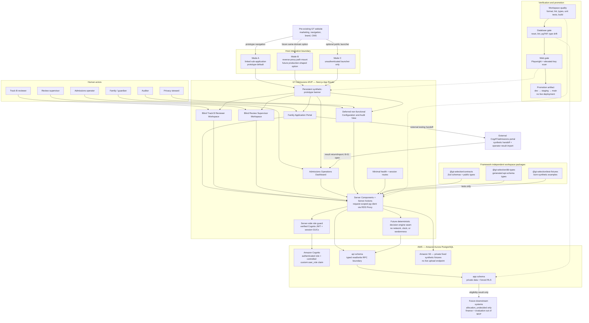

# GT Admissions MVP — Web Application Architecture Plan

**Status:** Approved by D-011 for the synthetic four-week prototype only; not live admissions.
**Scope of this document:** End-to-end technical architecture for the Next.js + AWS (Amazon Aurora PostgreSQL) web application described in `docs/product/GT_ADMISSIONS_APPLICATION_MVP_PRD.md` (§ Tech Stack), designed to embed into a pre-existing GT website and to support every PRD product surface and feature.
**Owner:** Aadi (backend/admissions logic) with Tiffany (product/frontend) on the shared frontend/backend interface. See PRD § Division of Labor.

> **Platform note (D-012):** This plan targets **AWS managed services with PostgreSQL retained** as the database engine. The security and replay design below (forced RLS, `SECURITY DEFINER` RPCs, immutable versioning, hash-chained audit, deterministic replay) is engine-level and therefore unchanged by the platform move; only the *bindings* change — Supabase Auth → Amazon Cognito, `@supabase/ssr` → `pg`/RDS Proxy, `auth.uid()` → request-scoped PostgreSQL session settings (GUCs), and the loopback guard → a dev-account/resource-tag guard. The canonical Supabase→AWS mapping lives in `docs/governance/DECISION_LOG.md` D-012. Where this document still says "`authenticated`," "definer RPC," or "RLS," those are retained verbatim; where it names a Supabase-specific binding, the AWS equivalent is given inline.

This plan is deliberately consistent with the existing backend research corpus. It does not re-specify the data model, RLS rules, canonicalization, or API contract already established there; it references them as authoritative and adds the application-level architecture and the pre-existing-website integration design, which the corpus does not yet cover. Authoritative sources:

- `research/backend-admissions/BACKEND_DATA_MODEL.md`
- `research/backend-admissions/MVP_DATA_CONTRACT.md`
- `research/backend-admissions/PROVISIONAL_IMPLEMENTATION_CONTRACT.md`
- `research/backend-admissions/RLS_AND_AUTH_BLUEPRINT.md`
- `research/backend-admissions/CANONICALIZATION_AND_REPLAY_BLUEPRINT.md`
- `research/backend-admissions/CHILD_DATA_PRIVACY_AND_RETENTION.md`
- `research/backend-admissions/MVP_THREAT_MODEL.md`

---

## Required plan header (per AGENTS.md § Required plan and handoff format)

- **Requirements:** R1, R5, R7, R8, R9, R10; H1, H2, H4, H7, H9, H10. (R2, R3, R6, H3, H5-protocol, H6, H8 are MVP-deferred per `docs/product/TRACEABILITY_MATRIX.md:15-31` and appear here only in the downstream-handoff seams, never as build items.)
- **Evidence/assumptions:** Grounded in the research corpus above and decisions D-008 (synthetic Track A/B prototype), D-009 → **D-012 (AWS/PostgreSQL backend platform, superseding the prior Supabase choice)**, D-010 (defers substantive appeal, automated retest/re-entry, allocation), D-011 (this architecture). New assumptions introduced by this plan are listed in § 12 for entry into `docs/research/ASSUMPTIONS_AND_EVIDENCE.md`.
- **In scope:** Application, routing, review, decision/replay, correction, config/audit surfaces; the embedding/integration layer for a pre-existing website; local-only synthetic operation.
- **Out of scope:** Finance/aid, seat allocation, evaluator exports, live child data, real uploads, production deployment, causal claims (PRD § Tech Stack; `MVP_DATA_CONTRACT.md:524-534`). The allocation seam is `allocation_undecided` only (B-08).
- **Acceptance evidence:** The MVP Acceptance Checks in the PRD (§ MVP Acceptance Checks) plus the merge-blocking gate IDs from the corpus (§ 10 below). Each is expressed as an automated test.
- **Risks:** Reviewer-blindness leakage, RLS/IDOR bypass, service-key exposure, decision non-determinism, prohibited-field leakage into eligibility, and integration-boundary trust confusion (embedding a synthetic app in a real site). Mitigations in § 9.
- **Governance updates:** `docs/governance/DECISION_LOG.md` (this architecture as a material decision; new integration decision), `docs/product/TRACEABILITY_MATRIX.md` (add TECH/ARCH row), `docs/research/ASSUMPTIONS_AND_EVIDENCE.md` (integration assumptions). Listed in § 12.

---

## 1. Architectural goals and non-negotiable invariants

The architecture is organized around invariants that the corpus already ratified. Every design choice below is subordinate to these; if a convenience conflicts with one, the invariant wins.

1. **Determinism & replay (R7).** Every decision is reproducible byte-for-byte from retained canonical inputs + immutable policy bundle + code/environment manifest. `result_hash` is the single decision-root commitment (`CANONICALIZATION_AND_REPLAY_BLUEPRINT.md:239-261`).
2. **Immutable versioning (R1, R7).** Submitted rows are never edited. Corrections create successors; chains never branch (`MVP_DATA_CONTRACT.md:92`).
3. **Reviewer blindness (R5, H2).** No reviewer can observe another's rating — before or after their own lock; the supervisor sees no prior vote; the family never learns vote direction or count (`RLS_AND_AUTH_BLUEPRINT.md:211-221`).
4. **Prohibited/private-field firewall (R4, H2, H9).** Accommodation, referral source, consent, identity, income, and all prohibited inputs (PRD § Prohibited Eligibility Inputs) are physically excluded from the decision projection; changing them changes zero decisions or hashes.
5. **Eligibility ≠ admission (R10).** No surface ever emits admitted / offered / waitlisted / funded / "not gifted" / program-effect language; allocation is a downstream `allocation_undecided` seam (B-08).
6. **Born-synthetic, fail-closed (R9).** All data synthetic; startup fails unless it is running in the designated **dev AWS account with the required synthetic resource tags** (replacing the prior loopback guard); no live child data, no uploads, no external AI (`CHILD_DATA_PRIVACY_AND_RETENTION.md:373-389`).
7. **Least authority (R9).** RLS `ENABLE`+`FORCE` on every private table; **no RLS-bypassing credential exists in the application runtime** — the app connects as a non-`BYPASSRLS` role via RDS Proxy, and elevated/admin access is confined to the out-of-band provisioning toolchain (`RLS_AND_AUTH_BLUEPRINT.md:251-260`; see § 7.1).

---

## 2. System context (C4 level 1)



The MVP is a **self-contained bounded system** that the host website *composes with* rather than *contains*. This boundary is the crux of the "easily integratable" requirement and is detailed in § 6.

---

## 3. Technology stack (locked)

Per PRD § Tech Stack and `PROVISIONAL_IMPLEMENTATION_CONTRACT.md:10-24`:

| Layer | Choice | Notes |
|---|---|---|
| Runtime | Node 24 LTS | Pinned |
| Package manager | pnpm 10 | Committed lockfile (supply-chain gate) |
| Web framework | Next.js (App Router) + TypeScript | SSR-first; **no CDN/ISR caching of authed pages** |
| Hosting / delivery | Container on **Amazon ECS Fargate**, fronted by **CloudFront + ALB** | Container is cloud-portable |
| Serverless compute | **AWS Lambda** — exam scoring + deterministic-replay engine, event-invoked (D-019) | Additive to Fargate; the versioned Lambda is the R7 deterministic-replay unit, holds server-side keys + pinned params + seed; structure-agnostic (scores whatever the sequencer produced) |
| DB / platform | **Amazon Aurora Serverless v2 (PostgreSQL-compatible)** | Standard PostgreSQL — RLS/RPCs/replay unchanged; dev account only, no production account |
| Auth / identity | **Amazon Cognito** user pool | JWT carries a `custom:user_role` claim (admin-controlled); identity is the `sub` claim |
| DB client | **`pg` (node-postgres)** via **Amazon RDS Proxy**, request-scoped, one txn/request | Verify the Cognito JWT server-side, then `SET LOCAL app.user_id`/`app.user_role`; connect as a non-`BYPASSRLS` role; never authorize from a cookie alone |
| Object storage | **Amazon S3** (private, pre-signed URLs) | No public objects; no live upload endpoint |
| Secrets / credentials | **AWS Secrets Manager** + IAM DB auth | No RLS-bypassing credential in the app runtime |
| Validation | Zod, shared client/server contracts | Single source of request/response shapes |
| DB access | Raw SQL + RPCs, **no ORM** | Definer RPCs are the write surface |
| Tests | Vitest (unit/contract) + pgTAP | RLS/replay/gate tests (run against Aurora / a local Postgres container) |
| Types | Generated PostgreSQL/`api`-schema TS types | Regenerated on migration |
| Infrastructure as code | **Terraform** | Cloud-portable; no console-only resources |
| Canonicalization | RFC 8785 JCS + SHA-256 (`sha256+jcs-rfc8785+gt-v1`) | Bytes produced in TS, verified in DB |

No ORM, no production account, no upload endpoint, no external AI service, and no RLS-bypassing credential in the application runtime.

---

## 4. Application architecture (C4 level 2 — containers/modules)

### 4.1 Next.js structure — four functional persona surfaces

Family, admissions, reviewer, and review-supervisor routes are the functional
MVP surfaces under D-014. Each is guarded by role at the layout boundary.
Server Components read via request-scoped clients; all mutations go through
Server Actions → definer RPCs (never direct table writes from the client). The
existing config/audit placeholder is deferred as a functional persona page.

```
app/
  (embed)/                     # thin, embeddable entry points (see § 6)
    family/                    # Family Application Portal        → F2-F6, F9
      setup/ apply/            #   profile + cycle draft, autosave, submit
      cogat/ routing-result/   #   external handoff + automatic routing notice
      status/                  #   status projection, next steps, notices
      snapshot/                #   Track B artifact / narrative routes
      decision/                #   final eligibility + explanation
      correction/              #   factual/procedural correction
    review/                    # Blind Track B Reviewer Workspace  → F8
      queue/  case/[id]/       #   assigned cases; blind rating form
    review-supervisor/         # Blind slot-three workspace        → F8
      queue/  case/[id]/       #   no prior votes or override
    admissions/                # Admissions Operations Dashboard   → F7, F11
      applications/ assessment/ pending/ assignments/ corrections/
    config-audit/              # deferred non-functional placeholder
      policy/ decisions/ replay/ claims/ audit-log/
  api/health, api/session      # minimal route handlers
lib/
  db/ (pg pool via RDS Proxy; per-request txn + session GUCs)   auth/ (Cognito JWT verify)
  contracts.ts (adapter over packages/contracts)   engine/ (future decision engine)
  canonical/ (JCS + hashing)              rpc/ (typed RPC wrappers)
db/
  migrations/ (schema, RLS, RPCs, seed)   tests/ (pgTAP)
infra/
  terraform/ (Aurora, Cognito, S3, ECS, RDS Proxy, Secrets Manager, CloudFront)
```

> **Code-migration note:** the current prototype still uses the Supabase directory layout (`apps/web/src/lib/supabase/`, top-level `supabase/`). Renaming to the AWS bindings above (`lib/db/`, `lib/auth/`, `db/`, `infra/terraform/`) and replacing `@supabase/*` with `pg` + Cognito verification is a **tracked follow-up** (D-012 consequences); the descriptions here are the target, not the current on-disk state.

In the monorepo, this application tree lives under `apps/web/src/`.
Framework-independent Zod schemas live in `packages/contracts`, generated exposed-schema types
live in `packages/db-types`, and fixed fictional examples live in `packages/test-fixtures`.
`apps/web/src/lib/contracts.ts` is only the application-facing re-export; packages never import
from `apps/web`.

**Rendering rules (security-driven):**
- Authed pages are dynamically rendered; **no CloudFront/ISR caching of authenticated content** (`RLS_AND_AUTH_BLUEPRINT.md:43-52`).
- Role gating happens server-side in each route group's `layout.tsx` by **verifying the Cognito JWT** (signature + expiry against the user-pool JWKS); the client never decides authorization.
- The family status page renders only the **status projection** enum (§ 4.3), never raw scores, reviewer identities, votes, or the audit log.

### 4.2 Module ↔ surface ↔ requirement map

| PRD module | Surface(s) | Primary R/H | Feature IDs |
|---|---|---|---|
| Account/profile setup + cycle application | Family Portal | R1, R5, R7–R10, H2, H4, H7, H9, H10 | F2-F6, F10 |
| External CogAT handoff + automatic routing | Family + Admissions | R1, R5, R8, R10, H9 | F7 |
| Track B Snapshot | Family Portal | R5, H1, H2, H10 | F3-F5 |
| Blind independent review + slot-three vote | Reviewer + Supervisor Workspaces | R5, R7, H1, H2 | F8 |
| Decision explanation / correction / re-entry | Family + Admissions | H9, R9, R7 | F9 |
| Configuration & audit controls | Backend/tests; future Config/Audit View | R7, R10, R8, H5 | F1, F11 |

(Cross-cutting concern → R/H mapping in § 5.3 of the feature map; reproduced in § 9 risk table.)

### 4.3 Frontend/backend interface (the shared contract)

This is the **shared file** both members build against (PRD § Shared Work). It is already specified; the architecture consumes it verbatim.

**Implemented Milestone A family RPCs (8):**
`save_student_profile`, `get_student_profile`, `list_student_profiles`,
`list_active_schools`, `save_application_draft`, `get_application`,
`submit_application`, and `get_application_status`. All are
`SECURITY DEFINER`, owned by `api_executor`, use a pinned
`pg_catalog, extensions` search path, and expose no writable API tables.

B11B calls these through server-only actions and the local authenticated
PostgREST client. PostgREST verifies the local JWT; a synthetic-only binder
reads only `sub` and admin-controlled `app_metadata.user_role`, requires the
designated loopback issuer, and sets transaction-local D-012 GUCs. Actor and
role never come from action input. B11A later replaces this local binding with
Cognito verification plus `pg`/RDS Proxy without changing the frontend
contracts. Next instrumentation validates B11B at server bootstrap whenever
either local-adapter setting is present, while ordinary builds with B11B
disabled remain unaffected. CI signs in through the real local Auth endpoint,
populates the same cookie store consumed by the server client, and invokes all
frontend-exported onboarding actions. Separate authenticated clients also race
save and submit to verify one winner plus deterministic
`STALE_VERSION`/`SUBMISSION_LOCKED` outcomes.

**Full admissions write RPC catalog (7)** — the first two are implemented for
onboarding; Server Actions ultimately call the rest over `pg`. All follow the
same definer, role, ownership/assignment,
`expected_version`, idempotency, allowlist, and synthetic-context controls
(`PROVISIONAL_IMPLEMENTATION_CONTRACT.md:113-202`):

1. `api.save_application_draft` · 2. `api.submit_application` · 3. `api.record_assessment_version` · 4. `api.submit_snapshot_version` · 5. `api.submit_review` · 6. `api.apply_correction` · 7. `api.replay_decision`.

The remaining admissions reads are `api.get_assigned_review_case` and
`api.get_decision_explanation`; `api.get_application_status` is already
implemented above. Any future view must be `security_invoker=true` with
explicit column grants.

**Request contract:** every mutation carries `idempotency_key`, `expected_version` (when stateful), `correlation_id`; actor identity from the verified Cognito `sub` (surfaced to SQL as `current_setting('app.user_id')`), role from the `custom:user_role` JWT claim (never the request body). Idempotency unique on `(actor_id, rpc_name, idempotency_key)`; assignment/finalization run at serializable isolation with retry on `40001`.

**Status projection enum** (family-facing display codes): `application_draft, awaiting_assessment, assessment_needs_correction, track_a_eligible, track_b_snapshot_required, snapshot_under_review, review_pending_family_action, review_pending_internal_action, track_b_eligible, track_b_does_not_currently_qualify, no_current_pathway, policy_configuration_pending`. Never emits admitted/offered/funded/"not gifted"/program-effect language (`PROVISIONAL_IMPLEMENTATION_CONTRACT.md:227-257`).

**Error contract:** the fixed HTTP/error-code set in `PROVISIONAL_IMPLEMENTATION_CONTRACT.md:204-224`. Pending is a *successful domain result*, not a 4xx.

---

## 5. Data architecture

### 5.1 Schema layout

Executable cut uses two schemas behind forced RLS (`PROVISIONAL_IMPLEMENTATION_CONTRACT.md:53-56`):

- `app` — all private tables. No direct external grants. D-013 is implemented
  with a grouped student/household profile version, directory versions, and a
  purpose-separated application-private-context version.
- `api` — the only externally reachable surface: definer RPCs + `security_invoker` views.
- Identity is external to the database: **Amazon Cognito** owns user records; the database only receives the verified `sub` and `custom:user_role` as request-scoped session settings (`app.user_id`, `app.user_role`). There is no in-database `auth` schema.

The full research model's purpose-separated schemas (`admissions`, `policy`,
`evidence`, `review`, `decision`, `audit`, `consent_private`,
`privacy_private`, future `allocation`/`evaluation`) are the *target*
separation; the MVP collapses them into `app` with the same firewall rules
enforced by RLS predicates and the decision-projection allowlist rather than by
schema walls. D-013 permits synthetic financial-intake versions inside the
private `app` boundary but no aid-decision or W-2/document surface. Future
allocation/evaluation schemas are absent and unreachable in MVP.

### 5.2 Core entities

Account/setup entities added by D-013 are deliberately small:
`student_profile` + `student_profile_version`,
`school_directory_version`, and `application_private_context_version`.
Profile JSONB groups child identity, household/address, relative, and language
fields under explicit purpose metadata. Private-context JSONB groups
support/disclosure and financial intake while remaining physically separate
from the application core. Each submitted `application_version` binds exact
profile/private/directory references and stores immutable school and final
submission snapshots.

Admissions entities: `application`, `application_version`,
`assessment_version`, `policy_bundle` (+ `policy_version`), `snapshot_version`
(+ `snapshot`, `snapshot_item`), `review_case`, `review_assignment`,
`review_submission` (+ `dimension_rating`), `pending_item`, `decision_run` (+
`decision_input_*`, `decision_result`, `decision_reason`, `decision_trace`,
`decision_notice`), `audit_event`, and minimized `applicant_context`. Detailed
field work is indexed in `ONBOARDING_OVERHAUL_TICKETS.md` and
`MVP_DATA_CONTRACT.md`.

**Load-bearing patterns:**
- **Immutable successor versioning** — `*_version(version_no, supersedes_id, content_hash)`; one predecessor has at most one active successor; corrections append, never mutate.
- **Immutable policy bundle** — every `decision_run` references exactly one `policy_bundle` (`PB-SYN-01`, `synthetic_only=true`, `validated=false`); config is a typed rule AST, never SQL.
- **Append-only hash-chained audit** — `audit_event(sequence, previous_hash, event_hash, ...)`, single genesis, contiguous sequence, no update/delete for any application role.
- **Field registry** (future-design gate) — every stored field carries a `field_registry` entry with `synthetic_only=true`, data class, `decision_use`, `prohibited_uses`; a migration adding an unregistered field fails CI.

### 5.3 The decision projection (firewall implementation)

The decision engine never hashes or reads a whole row. It reads an **allowlisted projection** containing only decision-relevant fields; identity, accommodation, consent, referral, and every prohibited input are structurally absent from the projection (`CANONICALIZATION_AND_REPLAY_BLUEPRINT.md:165-210`). Reference ordering is fixed (application → assessment → snapshot → evidence → review; submissions by slot; policy members in fixed order; reasons by locked `reason_order`). This is how R4/H2 become a mechanical guarantee rather than a code-review promise.

Milestone A currently implements only the onboarding firewall seam: the exact
allowlist is current grade, requested year/grade, and the synthetic marker, with
a separate SHA-256 projection commitment. Tests mutate every represented D-013
prohibited class and feed the unchanged projection to a deterministic test-only
consumer, proving unchanged probe result/hash. No eligibility engine,
eligibility result, or decision-root hash exists yet, so this evidence must not
be described as implemented decision-result invariance; that remains part of
the later D-014 routing/decision build.

---

## 6. Integration with a pre-existing website (the "easily integratable" requirement)

This is the part the existing corpus does not yet cover and the explicit ask. The design goal: a family on the existing GT site moves into the application and back **without a jarring seam**, while the synthetic prototype stays a **hard trust boundary** (it must never look like it is transacting real admissions on the real site).

### 6.1 Integration principle: composition, not absorption

The MVP is deployed as its own **CloudFront origin** (e.g. `apply.gt.example`, served by the ECS Fargate service behind CloudFront + ALB) and the host site composes with it. We do **not** rewrite the host site into Next.js, and we do **not** inline the app's authed surfaces into the host's CMS. Rationale: the app carries RLS, Cognito auth, forced-dynamic rendering, and a fail-closed synthetic guard that must not be diluted by the host's caching/CDN/auth assumptions. Because it is a standard container behind CloudFront, the same artifact can move to another cloud or a self-hosted origin unchanged.

### 6.2 Three supported integration modes (choose per host constraint)

| Mode | How | Best when | Trade-offs |
|---|---|---|---|
| **A. Linked sub-application (recommended)** | Host links/CTA to `apply.gt.example`; app renders full-page with a shared header/footer theme matching the host. | Host is a classic CMS/marketing site; cleanest security boundary. | Full navigation to a new origin (mitigated by shared theming + return links). |
| **B. Reverse-proxy path mount** | Host serves the app under a path (e.g. `gt.example/apply/*`) via reverse proxy / Next.js `basePath` + `assetPrefix`. | Host wants one domain, unified nav. | Requires host proxy config; cookie scoping and CSP must be coordinated. |
| **C. Embedded widget (entry points only)** | A small script mounts *non-authed* entry widgets (e.g. "Start / resume application", status lookup CTA) inside host pages via iframe; the iframe navigates into the full app for anything authed. | Host wants inline entry within existing pages. | Authed flows never live inside the host DOM; iframe is a launcher, not the app. |

**Decision default:** Mode A for the prototype demo, with Mode B documented as the production-shaped option. Mode C's iframe is restricted to unauthenticated launcher content so no session/token ever renders inside the host's document. This is a deliberate security posture, not a limitation to fix later.

### 6.3 What crosses the boundary (and what must not)

- **Allowed across:** brand theme tokens (colors, logo, fonts) applied to the app shell; deep links (`/family/apply`, `/family/status`); a signed *return* URL back to the host.
- **Never across:** the Cognito JWT / session tokens, any AWS credential, raw scores, reviewer data, or any authed HTML rendered inside the host DOM. The host is treated as untrusted for auth purposes.

### 6.4 Theming / brand-fit layer

A small theming contract lets the app adopt the host's look without coupling to its code: CSS custom properties (`--gt-color-*`, `--gt-font-*`, logo slot) resolved at the app's root layout, with a documented default. This satisfies "easily integratable" visually while keeping the app's DOM, CSP, and security model its own. Tiffany owns applicant-facing copy/theme tokens; Aadi owns the boundary and RPC contract (PRD § Shared Work ownership split).

### 6.5 Boundary security controls

- **CSP + framing:** the app sets `Content-Security-Policy: frame-ancestors` to only the host origin (Mode C) or `'none'` (Modes A/B); `X-Frame-Options` consistent. No authed route is ever frameable.
- **Cookies:** `SameSite=Lax`, `Secure`, `HttpOnly`, host-only scope for the app origin; not shared with the host.
- **CORS:** the `api` RPC surface is same-origin to the Next.js app only; no cross-origin browser calls.
- **Synthetic banner:** every embedded and full-page surface renders a persistent "Synthetic prototype — not a real admissions decision" marker so composition into a real site cannot be mistaken for live admissions (supports R10 claim boundaries and the PRD post-submission notice).
- **Return/handoff:** the downstream allocation/finance/evaluation handoff is an `allocation_undecided` status object only — never a live redirect into a real system (B-08).

### 6.6 CogAT and downstream seams

CogAT is administered outside the product; results enter via `api.record_assessment_version` (manual/import by an admissions operator), never a live testing integration. Downstream allocation/evaluation consume the eligibility result as data via the future evaluator-export shape (out of MVP; `EVALUATOR_EXPORT_SPEC.md`), not a runtime call.

---

## 7. Security & access architecture

Directly per `RLS_AND_AUTH_BLUEPRINT.md`:

- **Principal model:** the PostgreSQL login role stays `authenticated` (a non-`BYPASSRLS` role reached via RDS Proxy); identity and business role come from the **verified Amazon Cognito JWT** — the app checks the signature/expiry against the user-pool JWKS, then sets request-scoped session settings `app.user_id` (from `sub`) and `app.user_role` (from the **admin-controlled** `custom:user_role` claim, never a self-service attribute). RLS predicates read these via `current_setting(...)`. Role change requires token refresh; stale-token behavior is explicitly tested.
- **Business roles:** `family, admissions_operator, reviewer, review_supervisor, decision_service, auditor, privacy_steward`. `policy_admin` has no runtime API in v1 (policy is migration-seeded).
- **Ownership model:** `app_owner` (NOLOGIN, NOBYPASSRLS) owns tables; `api_executor` owns definer RPCs. Every private table: `ENABLE` + `FORCE` RLS, then `REVOKE ALL` from public/`authenticated` (no broad grants; no elevated/admin role is reachable from the app connection).
- **Predicates:** `OWNS(application_id)` = `owner_user_id = current_setting('app.user_id')::uuid AND synthetic_only`; `ASSIGNED(review_case_id)` = active assignment for `current_setting('app.user_id')` with matching role. Wrong-owner returns identical **not-found** to absent (no existence oracle).
- **Reviewer blindness (enforced in DB, not UI):** RLS blocks reading a peer submission before *and* after one's own lock; the reviewer read RPC never joins peer submissions; the supervisor sees no prior vote; majority is computed only inside a private routine; the reviewer response says only `accepted`.
- **Private-field firewall:** identity/demographic, household/address/language,
  accommodation/support/disclosure, financial intake, consent, referral, and
  signature data live in private structures excluded from every evidence and
  decision manifest; eligibility functions cannot read them.
- **No RLS-bypassing capability in the app runtime (by construction).** See § 7.1 — this is treated as a structural property, not a discipline.

### 7.1 Eliminating RLS-bypass credential exposure by construction

On AWS the equivalent of the old Supabase "service-role key" is any credential that can reach the database **outside RLS** — most directly, DB credentials for a `BYPASSRLS`/owner role, or broad IAM permissions (e.g. `rds-db:connect` as an elevated role, unrestricted Secrets Manager reads). The conventional failure mode is the same: an elevated credential placed in the server/app environment for "admin" tasks, then leaked via a `NEXT_PUBLIC_` typo, a shared client imported into a Client Component, a log line, a fixture, or git history.

This architecture removes the risk at its root: **there is no legitimate runtime need for RLS bypass.** Every runtime path goes through the `authenticated` (non-`BYPASSRLS`) role → definer RPCs → forced RLS (§ 7). The only elevated operations are *provisioning* (migrate/seed/reset), which run from an out-of-band toolchain, not the deployable application. Therefore the application runtime **never possesses an RLS-bypassing credential.** You cannot leak what is absent.

Layered guards, primary → backstop:

1. **Capability elimination (primary).** The ECS task role and app environment grant only what a request needs: connect to RDS Proxy as the `authenticated` role (via IAM DB auth or a Secrets Manager secret scoped to that role) and read the app's own config. No `BYPASSRLS`/owner DB credential and no broad admin IAM policy is attached to the runtime. A code path attempting to obtain elevated access resolves to nothing and fails closed — by absence, not policy.
2. **Process separation.** Migrate/seed/reset live in a separate provisioning toolchain under `scripts/` (and `infra/terraform/`), run from CI/operator context under a **distinct IAM principal**, never importable from `app/` or `lib/` (enforced by a module-boundary lint rule). Their elevated credential is never part of the app's task role or config surface.
3. **Single audited DB-client factory.** `lib/db/` exposes exactly one connection factory bound to the `authenticated` role; it has no reference to an owner/elevated credential or admin IAM path. No second elevation-capable code path exists.
4. **Boot-time env allowlist.** The app validates its environment at startup against a Zod allowlist and refuses to boot if any unexpected/elevated secret (e.g. an owner DB URL, an admin key) is present — an accidental injection becomes a crash, not a latent exposure.
5. **Build-time bundle assertion.** CI fails if an elevated-credential pattern, or the provisioning module, appears in any client bundle, or if any `NEXT_PUBLIC_*` holds a secret.
6. **Dev-account, synthetic-only fail-closed guard.** The startup guard (`LC-01`, re-scoped for AWS) refuses to run unless it is in the designated **dev AWS account** with the required synthetic resource tags and against a synthetic-tagged database — replacing the old loopback check. No production account, and no untagged/production resource, is reachable.

**Honest limit:** an elevated provisioning credential still exists *somewhere* (layer 2 — CI/operator context), because the database must be migratable and resettable. It is confined to a distinct IAM principal outside the app runtime and, in the dev account, targets synthetic resources only. The precise guarantee is therefore: *the deployable application has no RLS-bypassing capability by construction, and reintroducing one fails the boot (layer 4) or the build (layer 5)* — not an unqualified "impossible" while a provisioning path exists. Gates `SR-01/02` verify layers 1, 3, and 5.

---

## 8. Decision engine & replay architecture

- **Isolation:** the engine (`lib/engine/`) is a pure, deterministic TypeScript module with no network, clock, randomness, or mutable external state at execution time (`CANONICALIZATION_AND_REPLAY_BLUEPRINT.md:212-237`). It reads the decision projection, applies the locked policy AST, and emits `{outcome, ordered reason codes, trace}`.
- **Canonicalization:** TypeScript produces canonical bytes (`RFC8785_JCS(envelope)`), computes `digest = "sha256:" + hex(SHA256(bytes))`; PostgreSQL stores `payload jsonb` (query), `canonical_bytes bytea` (authoritative), and only *verifies* via `digest(canonical_bytes,'sha256')` — never re-canonicalizes.
- **Decision-root commitment:** `decision_manifest` binds {kind, input-manifest hash, policy-bundle hash, code-manifest hash, engine flags}; `decision_result.result_hash` binds {decision-manifest hash, outcome, ordered reasons, trace hash}. Run IDs, timestamps, notice delivery, and supersession links are excluded from the root.
- **Replay procedure (`api.replay_decision`):** load exact versions → verify all hashes → load exact bundle + code/env → execute offline → compare outcome/reasons(byte-exact)/trace/root → append one replay audit event without touching the original. Replay statuses include `reexecuted_exact, record_reconstructed, digest_verified, not_replayable_missing_artifact, not_replayable_inputs_disposed, failed_integrity_check, failed_execution_mismatch`. Exact replay is never claimed when only hashes remain.

**Routing/eligibility logic** (from PRD): Track A cutoff unchanged; Track B invitation on promising-band OR strong battery profile; artifact route = 2 blind reviewers + blind third on disagreement; narrative route = 3 blind reviewers from the start; majority controls; uninterpretable/invalid evidence → `pending` (never a negative score); final Track B eligibility requires the CogAT gate *and* the reviewer majority *and* the evidence conditions. All thresholds are synthetic and versioned in the policy bundle.

---

## 9. Cross-cutting concerns → risk & requirement table

| Concern | R/H | Architectural control | Residual risk / mitigation |
|---|---|---|---|
| Auditability / replay | R7, R10, H5, H9 | Hash-chained audit; canonical bytes; deterministic engine; `replay_decision` | Owner can rewrite the ledger — detectable only vs. an externally retained checkpoint (out of MVP; noted, not solved) |
| RLS / IDOR | R9 | Forced RLS; non-BYPASSRLS connections; not-found on wrong owner | Every role×table×op pair tested (gate `IDOR-01`, `RLS-01`) |
| Reviewer blindness | R5, H2 | DB-enforced peer-read denial; private majority routine | Concurrency test: two submissions race; supervisor cannot read prior votes |
| Prohibited-field firewall | R4, H2, H10 | Decision projection allowlist; private schemas | Mutation test: change prohibited/consent/accommodation → zero decision/hash change |
| Accessibility | R9, H4, H7 | Route-equivalence data (`access_route_version`), pending-state fallback, semantic SSR, screen-reader/translation support | Accommodation never reduces independence score (rubric rule) |
| Correction / pending | H9, R9, R7 | `apply_correction` → successor + rerun; `pending_item` states | Substantive appeal + automated re-entry disabled → `FEATURE_DISABLED` (D-010) |
| Explainability | H9, R1, R10 | `decision_reason` + `decision_trace` + reason-code catalog; status projection | Every notice clause traces to an executed rule/event |
| Elevated-credential exposure (RLS bypass) | R9 | **Capability absent from app runtime by construction** (§ 7.1): ECS task role limited to the `authenticated` DB role, no owner/`BYPASSRLS` credential or broad admin IAM in the app, single non-elevating DB-client factory, boot-time env allowlist, build-time bundle assertion | Residual is only the CI/operator provisioning principal (distinct IAM, synthetic dev resources); reintroduction fails boot or build (gates `SR-01/02`) |
| Integration trust boundary | R9, R10 | Own origin; no authed content in host DOM; synthetic banner; CSP `frame-ancestors` | Iframe restricted to non-authed launcher (§ 6.2 Mode C) |
| Synthetic-only guarantee | R9 | Fail-closed startup unless in the dev AWS account with synthetic resource tags; `synthetic_only=true` everywhere | Startup assertion `LC-01` (AWS-rescoped), `BD-01` |

---

## 10. Testing & CI gate architecture (acceptance)

Two test tiers, both merge-blocking:

**A. PRD MVP Acceptance Checks** (PRD § MVP Acceptance Checks) — expressed as executable scenarios: Track A invariance under Track B enablement; promising profile → invitation (not eligibility); eligibility requires CogAT gate + majority; Snapshot completable without new child work; no-artifact → narrative fallback without penalty; artifact disagreement → blind supervisor; every narrative → three blind reviews; invalid evidence → pending + correction route; prohibited fields cannot enter eligibility; accommodation/research-refusal have no routing/eligibility effect; every decision replays from retained inputs; applicant messages imply no admission/"not gifted"/program effect.

**B. Corpus merge-gates** (the concrete CI bar):
- Auth/RLS: `AUTH-01/02, IDOR-01, GRANT-01, DEF-01, READ-01, RLS-01, SR-01/02, NEW-OBJECT` (any new table/view/function without declared RLS/grant/definer classification fails CI).
- Canonicalization/replay: `CAN-01, HASH-01, RP-01` (cold, network-disabled replay), `RP-02, AUD-01/02, IDEM-01, DBOWN-01`.
- Privacy/fixtures: `FI-01, BD-01, FW-01, RT-01, DL-01/02, RP-DEL-01, BK-01, LG-01, EV-01, LC-01`.

Tooling: Vitest for engine/contract/canonicalization; pgTAP (run against Aurora or a local PostgreSQL container) for RLS, blindness, immutability, and audit-chain properties.

---

## 11. Build sequence (aligned to the PRD four-week timeline)

| Week | This plan's deliverable | PRD goal |
|---|---|---|
| 1 — Plan | Lock the frontend/backend interface (§ 4.3), schema migrations + RLS skeleton, synthetic policy bundle, integration mode decision (§ 6.2) | Agree fields, interfaces, test cases, ownership |
| 2 — Build | Family Portal + status flow (Tiffany); `app`/`api` schema, RPCs 1-5, CogAT routing, reviewer workflow, eligibility engine (Aadi) | FE/BE work independently against the interface |
| 3 — Connect & test | Accessibility, corrections, pending states, explanations (Tiffany); audit history, replay, correction rerun, integration embedding (Aadi) | Complete Track A + Track B demo flows |
| 4 — Finalize | Usability + docs (Tiffany); regression, gate suite green, demo environment + host-site embed demo (Aadi) | Critic review, final fixes, rehearsal |

---

## 12. Governance updates required (per AGENTS.md § Update governance + Completion check)

Before this plan is marked complete:

1. `docs/governance/DECISION_LOG.md` — recorded: **D-011** (this architecture) and **D-012** (Supabase→AWS platform move, superseding D-009). No further decision entry required unless the integration mode or AWS mapping changes.
2. `docs/product/TRACEABILITY_MATRIX.md` — add/confirm an ARCH/TECH row citing R1, R5, R7, R8, R9, R10, H1, H2, H4, H7, H9, H10 and this file; note the D-009→D-012 platform change.
3. `docs/research/ASSUMPTIONS_AND_EVIDENCE.md` — record assumptions this plan introduces:
   - **A-INT-1:** The pre-existing GT website can either link to a separate origin (Mode A) or provide a reverse-proxy path mount (Mode B). *Evidence needed from GT IT; placeholder until confirmed (relates to B-06/B-07).*
   - **A-INT-2:** Host brand tokens can be supplied as CSS custom properties for the theming contract (§ 6.4). *Assumption; low risk.*
   - **A-INT-3:** No authenticated GT-site session is expected to SSO into the app for the MVP; the app owns its own synthetic auth. *Assumption consistent with synthetic-only scope.*
   - **A-AWS-1..3:** The AWS platform assumptions (dev-account access, Cognito as IdP, Aurora PostgreSQL availability) introduced by D-012 — recorded in `ASSUMPTIONS_AND_EVIDENCE.md`.

## 13. Open blockers referenced

- **B-06 `[PRIVACY]`** — child-data/consent/storage/security rules: MVP stays synthetic; integration keeps the app on its own origin partly to preserve this boundary.
- **B-07 `[GT INFO][PRIVACY]`** — artifact types/limits/storage: MVP uses fixed synthetic fixtures; no upload endpoint; integration mode does not change this.
- **B-08 `[FUTURE DECISION]`** — allocation/aid/MAP follow-up: downstream seam is `allocation_undecided` only.

---

*This plan does not invent GT facts, thresholds, authority, capacity, or data access. All Track A/B values are synthetic and versioned. It makes no causal or program-effect claim and preserves the eligibility-not-admission and selection-vs-program-effect boundaries.*
