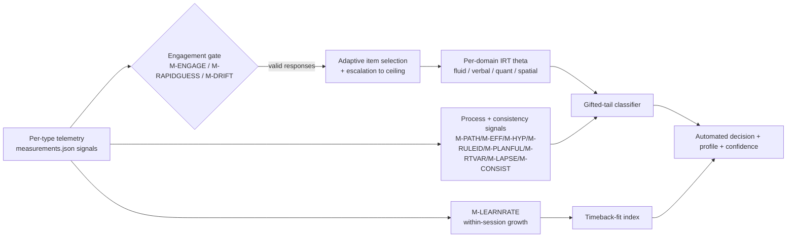

# Metric Framework — Fully-Automated, Timeback-Fit Scoring

How the exam turns per-type telemetry into a defensible gifted-tail
classification **scored without per-applicant human judgement**. "Automated"
throughout this file describes the scoring and classification pipeline, not the
whole admission decision: **R11 preserves a human path for near-miss cases and
behavioral (shadow-day) review**, and D-015 retains that shadow day explicitly.
Canonical measurement IDs live in `measurements.json` (rendered to
`MEASUREMENTS.md`); this file explains how they combine.

Serves **R5** (defensible capability + Timeback-fit standard), **R11** (scalable/
tunable screener), **H1** (broader measures), **H4** (broaden who can demonstrate
ability), **H10** (minimize gaming/burden). Reflects **D-015** (Timeback-fit
target, fully automated classification, snappy/adaptive) and **D-016**.
Born-synthetic under **RES-013**.

> Claim labels (per guardrails): *Verified* = established in the cited
> psychometric/cognitive literature; *Inference* = reasoned design choice;
> *Assumption* = open, to be validated. **Predictive validity is not program
> impact; a within-session learning-rate signal is a screening hypothesis, not a
> proven counterfactual of who will benefit.**

## 0. Design principles (what changed in the redesign)

1. **No human judge, no self-report.** Removed `M-RUBRIC` (human consensual
   product rating) and `M-CARELESS` (self-report validity). Every retained
   signal is machine-collectable from the interaction log. *(Inference: enables
   R11 scale and removes rater cost/bias; Assumption: automated proxies are
   adequate substitutes for rubric scoring — to be validated.)*
2. **Automate creativity** with behavioral proxies instead of rater judgement
   (§4).
3. **Learning rate is the north star**, not raw correctness (§2).
4. **Consistency over peak speed; speed only behind an engagement gate** (§3).
5. **One automated rollup** from telemetry → per-domain θ → gifted-tail
   classifier + Timeback-fit index (§5).

## 1. Domains and cross-cutting signals

- **Four scored domains:** `fluid_reasoning`, `verbal`, `quantitative`,
  `spatial`. Each yields its own IRT θ.
- **Cross-cutting signals (not domains), measured inside many types:**
  - **Working memory** — span/updating/binding measures (`M-SPAN`,
    `M-MANIPCOST`, `M-UPDATECOST`, `M-BETWEENERR`, `M-SEARCHSTRAT`,
    `M-PROCACC`) collected mostly within the visuospatial WM games now under
    `spatial`. Reported as a profile signal, not a fifth score.
  - **Processing speed** — `PS_GAMEBASED_WARRANT.md` **resolved to Rec B**: no
    dedicated PS types/domain. Speed is an **engagement-gated efficiency
    signal**, never a standalone domain (§3).
  - **Executive control** — inhibition/switching (`M-COMM`, `M-SSRT`,
    `M-CONGEFF`, `M-SWITCHCOST`, `M-PERSEV`, `M-POSTERR`) as a profile signal.
  - **Game-based delivery** — a wrapper, not a construct (warrant §Q2). Its
    only metric footprint is construct-irrelevant-variance control (self-teach
    + warm-up) and `M-ENGAGE`.

## 2. Ability core: ceiling, learning rate, planfulness, process

**Primary tail statistic — `M-DIFFREACH` (ceiling via escalation).** Adaptive
escalation walks each child to the exact difficulty they can bind before
failing. *(Verified: adaptive above-level ceiling probing maximizes tail
information — Embretson & Reise, 2000; Lohman on above-level testing.)*

**Timeback-fit core — `M-LEARNRATE` (NEW).** Within-session ceiling growth /
trials-to-mastery on a *novel* type. This operationalizes D-015: identify
children who **accelerate** on a self-paced mastery platform. Rooted in
**dynamic assessment / learning potential** — measuring the slope of
improvement given feedback, not just static status. *(Verified concept:
Vygotsky ZPD; Grigorenko & Sternberg, 1998, dynamic testing review; Budoff
learning-potential work. Assumption: within-session slope predicts real
platform acceleration — flagged for validation, NOT a will-benefit claim.)*

**Planfulness — `M-PLANFUL` (NEW).** Intentional/systematic vs random/impulsive
pre-commit behavior (e.g. Mystery Gate's intentional-vs-grounded-vs-random
signature), scored from the `M-PATH` action log. *(Verified: systematic search
/ metacomponential planning marks high ability — Sternberg componential theory;
CANTAB self-ordered search strategy scores.)*

**Reasoning-process quality (retained):** `M-PATH` (strategy signature),
`M-EFF` (efficiency vs optimal), `M-HYP` (hypothesis-search efficiency /
rule discovery), `M-RULEID` (relational-complexity dimensionality — Halford).
These separate *how* a child reasons, not just *whether* they were right, and
resist coaching.

**Item-level precision:** `M-ACC`, `M-POLY` (partial credit), `M-ERRTYPE` /
`M-LURETYPE` (near-miss vs random error → sub-cut placement), `M-CONSIST`
(parallel-form reliability shrinks the conditional SE at the cut),
`M-DIFFREACH` domain-specific companions (`M-PAE`, `M-WEBER`, `M-VOCABLVL`,
`M-INFDEPTH`, `M-ROTSLOPE`, `M-VIEWANG`, `M-SPAN`).

## 3. Consistency over speed + the engagement gate

**SPOV (D-015): speed is evidence ONLY under active engagement.** Fast-but-
disengaged ≠ able.

**Consistency signals (elevated, always count):** `M-RTVAR` (intra-individual
RT variability), `M-LAPSE` (worst-performance rule — the slowest responses are
most diagnostic), `M-CONSIST` (cross-item reliability). *(Verified:
worst-performance rule and intraindividual variability track g better than peak
speed — Coyle, 2003; Larson & Alderton, 1990.)*

**Engagement gate (must pass before speed counts):**

```
speed_valid(response) = M-ENGAGE.on_task            # not idle / blurred
                        AND NOT M-RAPIDGUESS.flag    # above solution-behavior RT floor
                        AND M-DRIFT.session_ok        # not late-session collapse
```

- `M-ENGAGE` (idle/blur/re-engage latency) and `M-DRIFT` (within-session
  fatigue slope) gate the whole session.
- `M-RAPIDGUESS` (NEW) flags per-response non-effortful guessing (response
  faster than a plausible solution-behavior floor) → excluded from θ and from
  any speed credit. *(Verified: effort-moderated / response-time-effort IRT —
  Wise & Kong, 2005; Wise & DeMars.)*

**Speed measures (count only when the gate passes):** `M-RT`, `M-COMBO`
(accuracy-gated speed streak), `M-SPEEDACC` (speed-accuracy tradeoff operating
point), `M-FALSEALARM` (impulsive fast-wrong). Speed is never rewarded when
accuracy is not held. Optional near-motor-free rate adjuncts (`M-HICKSLOPE`,
`M-ITTHRESH`, `M-ROTSLOPE`) index processing *rate* with the motor/device
confound partialled out; used as adjunct evidence, never as a primary score.

## 4. Automated creativity (proxies replace the rubric)

Creativity keeps a continuous axis CogAT lacks, scored with **zero human
judgement** (folded creativity types: Squiggle Studio, Brainstorm Blaster,
Investigation Station, Check It Twice, Question Quest):

| construct | automated proxy | measurement |
|---|---|---|
| originality | inverse response-frequency vs a per-prompt **response bank** (rare-but-appropriate) | `M-ORIG` |
| fluency | count of distinct valid on-topic responses | `M-IDEAFLU` |
| flexibility | number of distinct predefined semantic/functional categories touched | `M-FLEX` |
| elaboration | added descriptors / edits / strokes (action-and-edit count) | `M-ELAB` |

*(Verified: fluency/flexibility/originality/elaboration are the standard
divergent-thinking indices — Torrance TTCT; Guilford. Automating originality
via corpus frequency follows Ocsai / semantic-distance auto-scoring —
Beaty & Johnson, 2021.)*
**Feasibility flag / Assumption:** each such type needs a small per-type
lexicon/response-bank to score originality and to bin categories; building and
norming those banks is an open task before these proxies are trusted.

## 5. Automated classification rollup (no human in the loop)



1. **Gate** every response (§3). Effort-invalid responses are dropped.
2. **Adaptive selection + escalation.** Item selection maximizes Fisher
   information near the child's current θ and **escalates difficulty until
   failure** to fix `M-DIFFREACH`. *(This is the adaptivity RULE — see §6.)*
3. **Per-domain θ.** A (2PL/3PL or partial-credit) IRT model per domain gives θ
   with a conditional SE; `M-CONSIST` triggers extra items when SE at the cut is
   too high.
4. **Gifted-tail classifier.** Combines the four θ's with process/consistency
   signals and an above-cut posterior; outputs a decision **with a calibrated
   confidence**, not a single cut score. Null/uncertain is a valid output
   (defer / gather more items).
5. **Timeback-fit index.** A separate, explicitly-labeled composite dominated by
   `M-LEARNRATE` plus ceiling and planfulness — a *screening hypothesis* about
   acceleration readiness, **kept distinct from the ability θ** and **not** a
   claim that the child will benefit from any specific program.

Everything above is computed from logs by code. No rater, no manual review, no
questionnaire.

## 6. Escalation = the adaptivity rule (not a standalone type)

The former "Challenge Mountain" escalation type is **folded in as the exam-wide
adaptivity rule**: every type ships a difficulty spectrum and the engine
escalates until a fail-band, then backs off — that IS how `M-DIFFREACH`,
`M-LEARNRATE`, and per-domain θ are obtained. It is a mechanism, not a question
type, so it does not appear in the catalog.

## 7. Per-type obligations (enforced in Phase-2 demos)

Every rebuilt demo must expose an **automated live telemetry panel** logging its
declared `measurements`, a **difficulty spectrum + escalation**, and (for any
speed element) the engagement-gate fields. No panel value may require human
entry.

## References (concept sources; see also `PS_GAMEBASED_WARRANT.md`)

- Embretson, S. E. & Reise, S. P. (2000). *Item Response Theory for Psychologists.*
- Grigorenko, E. L. & Sternberg, R. J. (1998). Dynamic testing. *Psychological Bulletin* 124(1).
- Wise, S. L. & Kong, X. (2005). Response time effort. *Applied Measurement in Education* 18(2).
- Coyle, T. R. (2003). A review of the worst-performance rule. *Intelligence* 31(6).
- Halford, G. S., Wilson, W. H. & Phillips, S. (1998). Relational complexity. *BBS* 21(6).
- Beaty, R. E. & Johnson, D. R. (2021). Automating originality scoring (semantic distance / Ocsai). *Behavior Research Methods* 53.
- Torrance, E. P. (1974). *Torrance Tests of Creative Thinking.*
- Lohman, D. F. (2012). Above-level testing and the identification of academically talented students.
